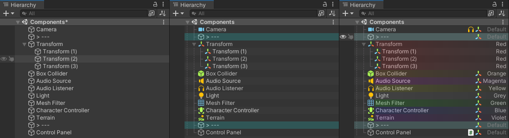

# sHierarchy
> Minimalistic good looking hierarchy

  

## 🏆 Features

* Show enable/disable state of each components
* Show log/warning/error icon
* Clean, no files are generated
* Clean, no other resource files
* Lightweight, no other dependencies
* No redundant workflow
* Work in Prefab Mode
